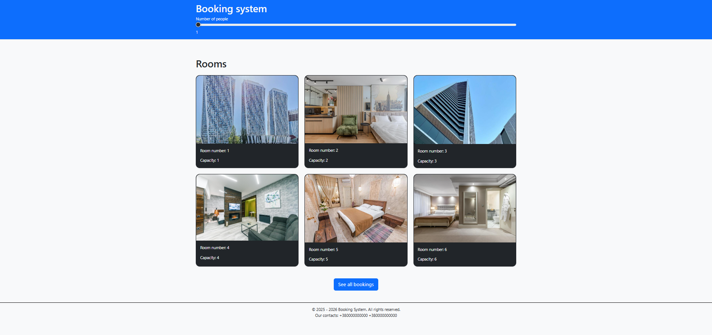
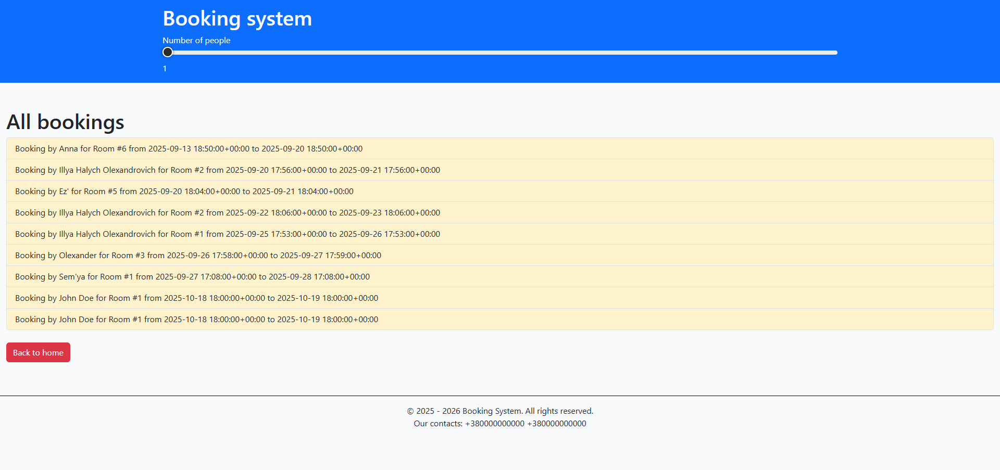

# Booking_system

## Overview

This is a django-based app for booking hotels' rooms. It includes browsing current bookings, seeing info about room, booking form and confirmation booking with an email.

## Models

**Room**: saves room information(room number, capacity, location, price per night, created at)
**Booking**: saves information about booking(which room user booked, start time of booking, end time of booking, creation time of booking, customer name, customer email, confirmation status)
**Room image**: saves the room and image of the room to which this image is linked.

## Tech Stack

- **Backend**: Django(python)
- **Frontend**: HTML, Bootstrap
- **Datatbase**: SQLite
- **Media**: Supporting Room Images with Django Media Handling

## Project structure

- **booking_system/**: Main project directory with settings and URL configurations
- **booking/**: Manages functionality(room browsing, info room, bookings in database, email confirmation and others)
- **Templates**:
  - `base.html`: base structure of site
  - `footer.html`: footer that in future extends in `base.html`
  - `header.html`: header that in future extends in `base.html`
  - `all_bookings.html`: browse all bookings in one list
  - `book_room.html`: booking form
  - `booking_email.html`: forms message for email to client
  - `confitm_booking.html`: browse a message that booking confirm is succesful
  - `index.html`: main page
  - `info_room.html`: browse info about room

## Insallation

1. **Clone git repository**

```bash
git clone https://github.com/Illugha/Booking_system.git
cd hotel-booking-system
```

2. **Install virtual environment**

```bash
pip install -m venv venv
venv\Scripts\activate   #Linux: source venv/bin/activate
```

3. **Install Dependencies**

```bash
pip install -r requirements.txt
```

4. **Apply migrations**

```bash
python manage.py migrate
```

5. **Create a superuser *(Optional)***

```bash
python manage.py createsuperuser
```

6. **Run server**

```bash
python manage.py runserver
```

7. **Open local site at `http://localhost:8000` or `http://127.0.0.1:8000/`**

## Urls

- `http://127.0.0.1:8000/` (or `http://localhost:8000`): home page
- `/info_room/<int:room_num>`: info about room + room_num
- `/room/<int:room_num>`: booking form
- `/all_bookings/`: list of all available bookings
- `/confirm/<int:room_id>/`: booking confirming with an email

## Usage

1. **Filter rooms**: Use a slider to filter rooms by capacity
2. **See all bookings**: Click the button below to see all reservations for all rooms
3. **Read information about the room**: Click on the room you want to select and then you will see information about it or click `Back to home` to return to home page
4. **Book room**: Fill out the booking form and then click `Book this room` to book room or click `Back to home` to return to home page
5. **Confirm booking**: Use the email you entered earlier in the form and confirm your booking.

## Features

1. **Filter**: Filtering room by capacity
2. **Room browsing**: View all available rooms with seeing capacity of it
3. **Booking**: Users can book rooms if this period is not reserved and confirm it with their mail
4. **All bookings**: Users can see all bookins in one list
5. **Availibility**: App created for working with all devices

## Screenshots

| Main page | Info room |
|-----------|-----------|
|  |  |

| Booking form | Successed booking |
|--------------| ------------------|
|  |  |

| Email form | Successed confirmation |
|------------|------------------------|
|  |  |

| Error in booking | All Bookings |
|------------------|--------------|
|  |  |

## Future improvements

- Add more styles to the site
- Multi-faceted room filter
- Account management
- Support multiple languages